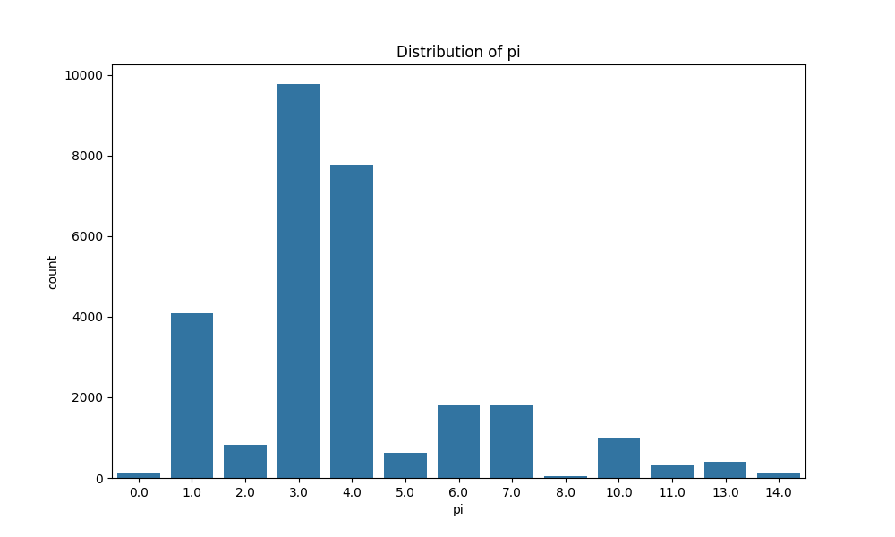
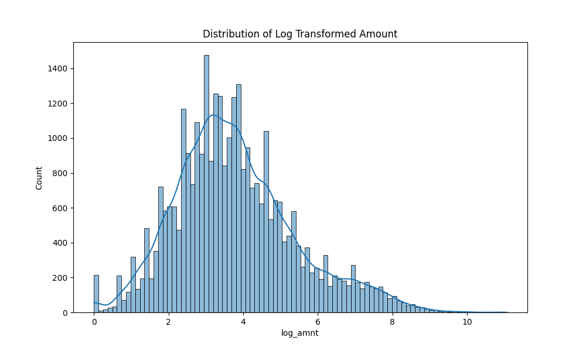
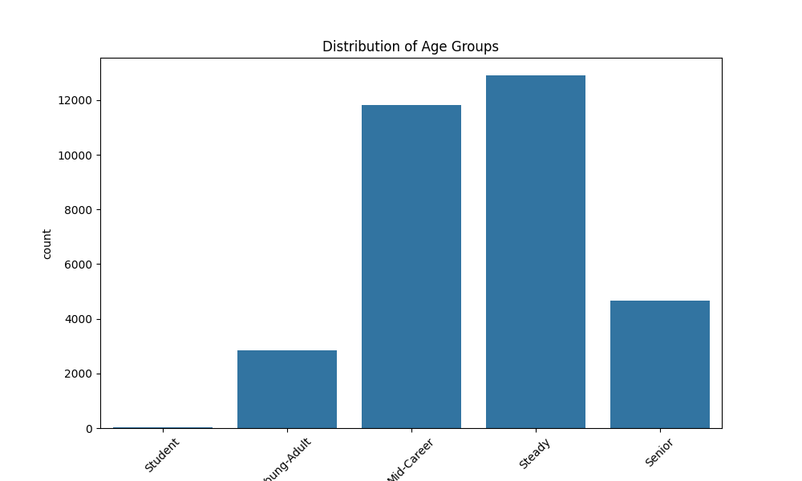

# Exploratory Data Analysis Report

## 1. Data Structure
- **Rows**: 32267
- **Columns**: 323

### Columns:
```
old_diary_day: int64
amnt_orig: float64
pi: float64
amnt: float64
merch: float64
cc_surcharge: float64
q101ee: float64
device: float64
in_person: float64
diary_day: float64
mobile_method: float64
authorization_method: float64
pay010: float64
enough_cash: float64
accept_cash: float64
accept_card: float64
dc_rewards: float64
used_rewards_cc: float64
used_revolve_cc: float64
cc_discount: float64
billautom: float64
bill: float64
payee: float64
discount: float64
tran_min: float64
payment: int64
module: object
start_date_x: object
nonpaymenttran: float64
chkdepfunds: float64
transaction_reported_on_day: int64
age: float64
highest_education: float64
work_occupation: float64
gender: float64
hhincome: float64
hourswork: float64
livewithpartner: float64
race: float64
marital_status: int64
hispaniclatino: int64
hispaniclatino_group: float64
workfullpart: float64
statereside: float64
laborstatus: float64
start_date_y: object
end_date: object
pa031: float64
pa035: float64
pa026_a: float64
csh_stored: float64
pa020: float64
pa055_b1: float64
pa055_b2: float64
pa055_b3: float64
pa055_b4: float64
pa055_b5: float64
mobile_adopt: float64
mobile_inperson_adopt: float64
mobile_p2p_adopt: int64
computer_adopt: float64
pa044_d: float64
pa013: float64
pa198_b: int64
fees_paid_atm: float64
fees_paid_overdraft: float64
fees_paid_bounced: float64
fees_paid_lowbal: float64
fees_paid_excesstran: float64
fees_paid_teller: float64
fees_paid_none: float64
pa092: object
chk_acnt_num: float64
sav_acnt_num: float64
pa053: int64
cc_rewards: float64
ccfee_csh: float64
ccfee_late: float64
ccfee_baltran: float64
ccfee_annual: float64
ccfee_overlimit: float64
ccfee_foreign: float64
ccfee_none: float64
pa056: float64
pa198_a: float64
pa198_c: float64
pa198_f: float64
pa198_g: float64
pa198_i: float64
pa198_k: int64
heard_crypto: float64
crypto_value: float64
pa133_a: float64
pa133_b: float64
pa133_c: float64
which_crypto_bitcoin: float64
which_crypto_eth: float64
which_crypto_doge: float64
which_crypto_lite: float64
which_crypto_other: float64
pa119: object
pa131_a: float64
pa050_csh: float64
pa050_chk: float64
pa050_mon: float64
pa050_dc: float64
pa050_cc: float64
pa050_svc: float64
pa050_banp: float64
pa050_obbp: float64
pa050_crypto: float64
pa024: int64
pa044_a: float64
pa044_b: float64
pa044_c: float64
pa044_g: float64
pa044_h: float64
pa044_i: float64
pa044_e: float64
pa044_j: float64
pa044_k: float64
pa040_e: int64
pa042_a: int64
used_chkcashing: float64
underbanked_monord: float64
pu010: float64
pu009: float64
pu011: float64
ph006: float64
ph004: int64
ph025: int64
ph025_b: float64
ph025_c: float64
ph025_d: float64
income_hh: float64
homeowner: float64
de012: float64
paypref_b1: float64
paypref_web: float64
q115_c_filter: float64
paypref_inperson: float64
bnpl001: float64
bnpl002: float64
bnpl003: float64
bnpl004: float64
bnpl006: float64
have_cash_end: int64
race_white: float64
race_black: float64
race_asian: float64
as003_a4: float64
as003_b4: float64
as003_h4: float64
as003_c4: float64
as003_d4: float64
as003_e4: float64
as003_f4: float64
as003_g4: float64
as003_g1: float64
as003_h1: float64
as003_a1: float64
as003_b1: float64
as003_c1: float64
as003_d1: float64
as003_e1: float64
as003_f1: float64
as003_h2: float64
as003_g2: float64
as003_f2: float64
as003_e2: float64
as003_d2: float64
as003_c2: float64
as003_b2: float64
as003_a2: float64
as003_a3: float64
as003_b3: float64
as003_c3: float64
as003_d3: float64
as003_e3: float64
as003_f3: float64
as003_g3: float64
as003_h3: float64
as003_h5: float64
as003_a5: float64
as003_b5: float64
as003_c5: float64
as003_d5: float64
as003_e5: float64
as003_f5: float64
as003_g5: float64
as003_h6: float64
as003_a6: float64
as003_b6: float64
as003_c6: float64
as003_d6: float64
as003_e6: float64
as003_f6: float64
as003_g6: float64
as003_i4: float64
as003_i1: float64
as003_i2: float64
as003_i3: float64
as003_i5: float64
as003_i6: float64
as003_a7: float64
as003_b7: float64
as003_c7: float64
as003_d7: float64
as003_e7: float64
as003_f7: float64
as003_g7: float64
as003_h7: float64
as003_i7: float64
citizen: int64
hh_size: int64
shops_online: float64
cashless01: float64
cashless11: float64
cashless12: float64
cashless13: float64
fr001_a: float64
fr001_b: float64
fr001_d: float64
fr001_e: float64
prev_income_receipt: object
inc_doyouget_employment: float64
inc_doyouget_empretire: float64
inc_doyouget_selfemployment: float64
inc_doyouget_socsec: float64
inc_doyouget_interest: float64
inc_doyouget_rental: float64
inc_doyouget_govtasst: float64
inc_doyouget_alimony: float64
inc_doyouget_childsupport: float64
inc_doyouget_otherretire: float64
inc_howoften_employment: float64
inc_howoften_empretire: float64
inc_howoften_selfemployment: float64
inc_howoften_socsec: float64
inc_howoften_interest: float64
inc_howoften_rental: float64
inc_howoften_govtasst: float64
inc_howoften_otherretire: float64
e_exp_prepaid_saved: float64
e_exp_cover: float64
e_exp_csh: float64
e_exp_chk: float64
e_exp_prepaid: float64
e_exp_od: float64
e_exp_cc: float64
e_exp_sav: float64
e_exp_heloc: float64
e_exp_pawn: float64
e_exp_payday: float64
e_exp_csh_saved: float64
e_exp_tot_saved: int64
e_exp_sav_saved: float64
e_exp_chk_saved: float64
e_exp_fam: float64
chk_acnt_adopt: int64
sav_acnt_adopt: int64
bnk_acnt_adopt: int64
paypal_adopt: float64
zelle_adopt: float64
venmo_adopt: float64
cashapp_adopt: float64
other_nbops_adopt: float64
nbop_acnt_adopt: float64
ob_adopt: float64
mb_adopt: float64
chk_adopt: int64
mon_adopt: float64
csh_adopt: int64
paper_adopt: int64
dc_adopt: float64
cc_adopt: int64
svc_adopt: float64
card_adopt: float64
banp_adopt: float64
obbp_adopt: float64
elect_adopt: float64
crypto_adopt: float64
crypto_used: float64
cc_num: float64
dc_num: float64
pa126_a: float64
ph009_a: float64
ph009_b: float64
ph009_c: float64
ph009_d: float64
race_other: float64
work_employed: float64
work_onleave: float64
work_temp_unemployed: float64
work_looking: float64
work_retired: float64
work_disabled: float64
work_other: float64
work_self: float64
census_division: float64
next_income_receipt: object
memory_receipts: float64
memory_finrec: float64
memory_memory: float64
memory_oth: float64
memory_none: float64
interest_level: float64
watch_video: float64
video_helpful: float64
bnpl008: float64
urban_cat: float64
urbanicity: float64
ind_weight: float64
ind_weight_all: float64
month: float64
day: float64
day_of_week: float64
is_weekend: int64
is_payday: int64
log_amnt: float64
amnt_bin: category
age_group: category
amnt_income_interaction: float64
```

## 2. Missing Values
| Column | Missing Count | Percentage |
|---|---|---|
| pi | 3571 | 11.07% |
| merch | 3468 | 10.75% |
| cc_surcharge | 22494 | 69.71% |
| q101ee | 24499 | 75.93% |
| device | 3480 | 10.79% |
| in_person | 3478 | 10.78% |
| diary_day | 3505 | 10.86% |
| mobile_method | 26047 | 80.72% |
| authorization_method | 24160 | 74.88% |
| pay010 | 29689 | 92.01% |
| enough_cash | 18971 | 58.79% |
| accept_cash | 18970 | 58.79% |
| accept_card | 28634 | 88.74% |
| dc_rewards | 26995 | 83.66% |
| used_rewards_cc | 22512 | 69.77% |
| used_revolve_cc | 22503 | 69.74% |
| cc_discount | 22496 | 69.72% |
| billautom | 25737 | 79.76% |
| bill | 3460 | 10.72% |
| payee | 11266 | 34.91% |
| discount | 10651 | 33.01% |
| tran_min | 15846 | 49.11% |
| start_date_x | 28810 | 89.29% |
| nonpaymenttran | 28810 | 89.29% |
| chkdepfunds | 30341 | 94.03% |
| highest_education | 10 | 0.03% |
| work_occupation | 8325 | 25.80% |
| hhincome | 34 | 0.11% |
| hourswork | 8353 | 25.89% |
| livewithpartner | 16955 | 52.55% |
| race | 123 | 0.38% |
| hispaniclatino_group | 29043 | 90.01% |
| workfullpart | 8310 | 25.75% |
| statereside | 4 | 0.01% |
| laborstatus | 9 | 0.03% |
| pa031 | 762 | 2.36% |
| pa035 | 756 | 2.34% |
| pa026_a | 751 | 2.33% |
| csh_stored | 4 | 0.01% |
| pa020 | 28954 | 89.73% |
| pa055_b1 | 37 | 0.11% |
| pa055_b2 | 5 | 0.02% |
| pa055_b3 | 1 | 0.00% |
| pa055_b4 | 1 | 0.00% |
| pa055_b5 | 1 | 0.00% |
| mobile_adopt | 10 | 0.03% |
| mobile_inperson_adopt | 14 | 0.04% |
| computer_adopt | 3 | 0.01% |
| pa044_d | 119 | 0.37% |
| pa013 | 751 | 2.33% |
| fees_paid_atm | 628 | 1.95% |
| fees_paid_overdraft | 628 | 1.95% |
| fees_paid_bounced | 628 | 1.95% |
| fees_paid_lowbal | 628 | 1.95% |
| fees_paid_excesstran | 628 | 1.95% |
| fees_paid_teller | 628 | 1.95% |
| fees_paid_none | 628 | 1.95% |
| chk_acnt_num | 756 | 2.34% |
| sav_acnt_num | 5370 | 16.64% |
| cc_rewards | 3315 | 10.27% |
| ccfee_csh | 3313 | 10.27% |
| ccfee_late | 3313 | 10.27% |
| ccfee_baltran | 3313 | 10.27% |
| ccfee_annual | 3313 | 10.27% |
| ccfee_overlimit | 3313 | 10.27% |
| ccfee_foreign | 3313 | 10.27% |
| ccfee_none | 3313 | 10.27% |
| pa056 | 3316 | 10.28% |
| pa198_a | 23 | 0.07% |
| pa198_c | 30 | 0.09% |
| pa198_f | 24 | 0.07% |
| pa198_g | 33 | 0.10% |
| pa198_i | 18 | 0.06% |
| crypto_value | 29401 | 91.12% |
| pa133_a | 29375 | 91.04% |
| pa133_b | 29375 | 91.04% |
| pa133_c | 29371 | 91.02% |
| which_crypto_bitcoin | 29375 | 91.04% |
| which_crypto_eth | 29375 | 91.04% |
| which_crypto_doge | 29375 | 91.04% |
| which_crypto_lite | 29375 | 91.04% |
| which_crypto_other | 29375 | 91.04% |
| pa131_a | 11269 | 34.92% |
| pa050_csh | 7 | 0.02% |
| pa050_chk | 848 | 2.63% |
| pa050_mon | 70 | 0.22% |
| pa050_dc | 2499 | 7.74% |
| pa050_cc | 3313 | 10.27% |
| pa050_svc | 9988 | 30.95% |
| pa050_banp | 606 | 1.88% |
| pa050_obbp | 606 | 1.88% |
| pa050_crypto | 29371 | 91.02% |
| pa044_a | 69 | 0.21% |
| pa044_b | 149 | 0.46% |
| pa044_c | 140 | 0.43% |
| pa044_g | 75 | 0.23% |
| pa044_h | 48 | 0.15% |
| pa044_i | 52 | 0.16% |
| pa044_e | 183 | 0.57% |
| pa044_j | 120 | 0.37% |
| pa044_k | 108 | 0.33% |
| underbanked_monord | 30556 | 94.70% |
| pu010 | 18345 | 56.85% |
| pu009 | 3313 | 10.27% |
| pu011 | 19410 | 60.15% |
| ph006 | 13 | 0.04% |
| ph025_b | 3329 | 10.32% |
| ph025_c | 2503 | 7.76% |
| ph025_d | 789 | 2.45% |
| income_hh | 380 | 1.18% |
| homeowner | 4 | 0.01% |
| de012 | 28847 | 89.40% |
| paypref_b1 | 12 | 0.04% |
| paypref_web | 1856 | 5.75% |
| q115_c_filter | 2 | 0.01% |
| paypref_inperson | 1 | 0.00% |
| bnpl003 | 13666 | 42.35% |
| bnpl004 | 28486 | 88.28% |
| bnpl006 | 28486 | 88.28% |
| race_white | 123 | 0.38% |
| race_black | 123 | 0.38% |
| race_asian | 123 | 0.38% |
| as003_a4 | 25653 | 79.50% |
| as003_b4 | 25677 | 79.58% |
| as003_h4 | 25656 | 79.51% |
| as003_c4 | 25650 | 79.49% |
| as003_d4 | 25657 | 79.51% |
| as003_e4 | 25654 | 79.51% |
| as003_f4 | 25649 | 79.49% |
| as003_g4 | 25656 | 79.51% |
| as003_g1 | 25658 | 79.52% |
| as003_h1 | 25663 | 79.53% |
| as003_a1 | 25660 | 79.52% |
| as003_b1 | 25650 | 79.49% |
| as003_c1 | 25656 | 79.51% |
| as003_d1 | 25649 | 79.49% |
| as003_e1 | 25661 | 79.53% |
| as003_f1 | 25652 | 79.50% |
| as003_h2 | 25649 | 79.49% |
| as003_g2 | 25649 | 79.49% |
| as003_f2 | 25655 | 79.51% |
| as003_e2 | 25649 | 79.49% |
| as003_d2 | 25651 | 79.50% |
| as003_c2 | 25649 | 79.49% |
| as003_b2 | 25649 | 79.49% |
| as003_a2 | 25649 | 79.49% |
| as003_a3 | 25649 | 79.49% |
| as003_b3 | 25649 | 79.49% |
| as003_c3 | 25659 | 79.52% |
| as003_d3 | 25656 | 79.51% |
| as003_e3 | 25649 | 79.49% |
| as003_f3 | 25677 | 79.58% |
| as003_g3 | 25649 | 79.49% |
| as003_h3 | 25650 | 79.49% |
| as003_h5 | 25649 | 79.49% |
| as003_a5 | 25652 | 79.50% |
| as003_b5 | 25670 | 79.55% |
| as003_c5 | 25649 | 79.49% |
| as003_d5 | 25652 | 79.50% |
| as003_e5 | 25649 | 79.49% |
| as003_f5 | 25670 | 79.55% |
| as003_g5 | 25655 | 79.51% |
| as003_h6 | 25657 | 79.51% |
| as003_a6 | 25652 | 79.50% |
| as003_b6 | 25649 | 79.49% |
| as003_c6 | 25649 | 79.49% |
| as003_d6 | 25655 | 79.51% |
| as003_e6 | 25651 | 79.50% |
| as003_f6 | 25649 | 79.49% |
| as003_g6 | 25649 | 79.49% |
| as003_i4 | 25662 | 79.53% |
| as003_i1 | 25649 | 79.49% |
| as003_i2 | 25649 | 79.49% |
| as003_i3 | 25649 | 79.49% |
| as003_i5 | 25654 | 79.51% |
| as003_i6 | 25649 | 79.49% |
| as003_a7 | 25649 | 79.49% |
| as003_b7 | 25649 | 79.49% |
| as003_c7 | 25649 | 79.49% |
| as003_d7 | 25649 | 79.49% |
| as003_e7 | 25649 | 79.49% |
| as003_f7 | 25660 | 79.52% |
| as003_g7 | 25670 | 79.55% |
| as003_h7 | 25672 | 79.56% |
| as003_i7 | 25649 | 79.49% |
| shops_online | 2 | 0.01% |
| cashless12 | 4190 | 12.99% |
| cashless13 | 24476 | 75.85% |
| fr001_a | 6 | 0.02% |
| fr001_b | 7 | 0.02% |
| fr001_d | 6 | 0.02% |
| fr001_e | 6 | 0.02% |
| prev_income_receipt | 1794 | 5.56% |
| inc_doyouget_employment | 31 | 0.10% |
| inc_doyouget_empretire | 50 | 0.15% |
| inc_doyouget_selfemployment | 103 | 0.32% |
| inc_doyouget_socsec | 20 | 0.06% |
| inc_doyouget_interest | 45 | 0.14% |
| inc_doyouget_rental | 25 | 0.08% |
| inc_doyouget_govtasst | 33 | 0.10% |
| inc_doyouget_alimony | 32 | 0.10% |
| inc_doyouget_childsupport | 29 | 0.09% |
| inc_doyouget_otherretire | 88 | 0.27% |
| inc_howoften_employment | 13194 | 40.89% |
| inc_howoften_empretire | 27272 | 84.52% |
| inc_howoften_selfemployment | 27687 | 85.81% |
| inc_howoften_socsec | 22910 | 71.00% |
| inc_howoften_interest | 22576 | 69.97% |
| inc_howoften_rental | 30051 | 93.13% |
| inc_howoften_govtasst | 29124 | 90.26% |
| inc_howoften_otherretire | 27913 | 86.51% |
| e_exp_prepaid_saved | 840 | 2.60% |
| e_exp_cover | 21 | 0.07% |
| e_exp_csh | 2965 | 9.19% |
| e_exp_chk | 2485 | 7.70% |
| e_exp_prepaid | 2674 | 8.29% |
| e_exp_od | 2491 | 7.72% |
| e_exp_cc | 2612 | 8.09% |
| e_exp_sav | 2416 | 7.49% |
| e_exp_heloc | 2690 | 8.34% |
| e_exp_pawn | 2739 | 8.49% |
| e_exp_payday | 2746 | 8.51% |
| e_exp_csh_saved | 497 | 1.54% |
| e_exp_sav_saved | 372 | 1.15% |
| e_exp_chk_saved | 461 | 1.43% |
| e_exp_fam | 2787 | 8.64% |
| paypal_adopt | 69 | 0.21% |
| zelle_adopt | 149 | 0.46% |
| venmo_adopt | 140 | 0.43% |
| cashapp_adopt | 119 | 0.37% |
| other_nbops_adopt | 204 | 0.63% |
| nbop_acnt_adopt | 67 | 0.21% |
| ob_adopt | 147 | 0.46% |
| mb_adopt | 147 | 0.46% |
| mon_adopt | 70 | 0.22% |
| svc_adopt | 30 | 0.09% |
| banp_adopt | 2 | 0.01% |
| obbp_adopt | 2 | 0.01% |
| elect_adopt | 2 | 0.01% |
| cc_num | 3316 | 10.28% |
| dc_num | 2501 | 7.75% |
| pa126_a | 29371 | 91.02% |
| ph009_a | 7 | 0.02% |
| ph009_b | 1 | 0.00% |
| ph009_c | 22 | 0.07% |
| ph009_d | 1 | 0.00% |
| race_other | 123 | 0.38% |
| work_employed | 9 | 0.03% |
| work_onleave | 9 | 0.03% |
| work_temp_unemployed | 9 | 0.03% |
| work_looking | 9 | 0.03% |
| work_retired | 9 | 0.03% |
| work_disabled | 9 | 0.03% |
| work_other | 9 | 0.03% |
| work_self | 8325 | 25.80% |
| census_division | 3440 | 10.66% |
| next_income_receipt | 1839 | 5.70% |
| memory_receipts | 248 | 0.77% |
| memory_finrec | 248 | 0.77% |
| memory_memory | 248 | 0.77% |
| memory_oth | 248 | 0.77% |
| memory_none | 248 | 0.77% |
| interest_level | 268 | 0.83% |
| watch_video | 264 | 0.82% |
| video_helpful | 15709 | 48.68% |
| bnpl008 | 503 | 1.56% |
| urban_cat | 14 | 0.04% |
| urbanicity | 8274 | 25.64% |
| ind_weight | 2136 | 6.62% |
| month | 3457 | 10.71% |
| day | 3457 | 10.71% |
| day_of_week | 3457 | 10.71% |
| log_amnt | 3 | 0.01% |
| amnt_bin | 3 | 0.01% |
| amnt_income_interaction | 3 | 0.01% |

## 3. Target Distribution (pi)
| Class | Percentage |
|---|---|
| 3.0 | 34.07% |
| 4.0 | 27.07% |
| 1.0 | 14.22% |
| 7.0 | 6.35% |
| 6.0 | 6.33% |
| 10.0 | 3.51% |
| 2.0 | 2.89% |
| 5.0 | 2.15% |
| 13.0 | 1.41% |
| 11.0 | 1.10% |
| 0.0 | 0.38% |
| 14.0 | 0.37% |
| 8.0 | 0.15% |



## 4. Feature Analysis (New Engineering)
### Log Transformed Amount


### Age Groups


### Payday Transactions: 24.04%


## 5. Numerical Summary
|       |   old_diary_day |   amnt_orig |          pi |     amnt |       merch |   cc_surcharge |      q101ee |      device |    in_person |   diary_day |   mobile_method |   authorization_method |     pay010 |   enough_cash |   accept_cash |   accept_card |   dc_rewards |   used_rewards_cc |   used_revolve_cc |   cc_discount |   billautom |         bill |       payee |      discount |      tran_min |      payment |   nonpaymenttran |   chkdepfunds |   transaction_reported_on_day |        age |   highest_education |   work_occupation |       gender |   hhincome |   hourswork |   livewithpartner |        race |   marital_status |   hispaniclatino |   hispaniclatino_group |   workfullpart |   statereside |   laborstatus |        pa031 |        pa035 |      pa026_a |   csh_stored |       pa020 |      pa055_b1 |      pa055_b2 |      pa055_b3 |       pa055_b4 |      pa055_b5 |   mobile_adopt |   mobile_inperson_adopt |   mobile_p2p_adopt |   computer_adopt |      pa044_d |        pa013 |      pa198_b |   fees_paid_atm |   fees_paid_overdraft |   fees_paid_bounced |   fees_paid_lowbal |   fees_paid_excesstran |   fees_paid_teller |   fees_paid_none |   chk_acnt_num |   sav_acnt_num |        pa053 |   cc_rewards |     ccfee_csh |    ccfee_late |   ccfee_baltran |   ccfee_annual |   ccfee_overlimit |   ccfee_foreign |   ccfee_none |       pa056 |      pa198_a |      pa198_c |      pa198_f |      pa198_g |      pa198_i |       pa198_k |   heard_crypto |   crypto_value |     pa133_a |     pa133_b |      pa133_c |   which_crypto_bitcoin |   which_crypto_eth |   which_crypto_doge |   which_crypto_lite |   which_crypto_other |     pa131_a |    pa050_csh |    pa050_chk |     pa050_mon |     pa050_dc |     pa050_cc |    pa050_svc |   pa050_banp |   pa050_obbp |   pa050_crypto |        pa024 |      pa044_a |      pa044_b |      pa044_c |      pa044_g |      pa044_h |       pa044_i |       pa044_e |       pa044_j |       pa044_k |       pa040_e |       pa042_a |   used_chkcashing |   underbanked_monord |     pu010 |        pu009 |       pu011 |       ph006 |        ph004 |        ph025 |      ph025_b |       ph025_c |        ph025_d |    income_hh |    homeowner |       de012 |   paypref_b1 |   paypref_web |   q115_c_filter |   paypref_inperson |      bnpl001 |      bnpl002 |      bnpl003 |    bnpl004 |     bnpl006 |   have_cash_end |   race_white |   race_black |    race_asian |   as003_a4 |   as003_b4 |   as003_h4 |   as003_c4 |   as003_d4 |   as003_e4 |   as003_f4 |   as003_g4 |   as003_g1 |   as003_h1 |   as003_a1 |   as003_b1 |    as003_c1 |    as003_d1 |   as003_e1 |   as003_f1 |   as003_h2 |    as003_g2 |    as003_f2 |   as003_e2 |   as003_d2 |   as003_c2 |    as003_b2 |    as003_a2 |   as003_a3 |   as003_b3 |    as003_c3 |    as003_d3 |   as003_e3 |   as003_f3 |   as003_g3 |   as003_h3 |   as003_h5 |   as003_a5 |   as003_b5 |    as003_c5 |   as003_d5 |   as003_e5 |   as003_f5 |    as003_g5 |   as003_h6 |   as003_a6 |   as003_b6 |    as003_c6 |    as003_d6 |   as003_e6 |    as003_f6 |    as003_g6 |   as003_i4 |   as003_i1 |    as003_i2 |   as003_i3 |   as003_i5 |    as003_i6 |   as003_a7 |   as003_b7 |    as003_c7 |    as003_d7 |    as003_e7 |   as003_f7 |   as003_g7 |   as003_h7 |    as003_i7 |      citizen |     hh_size |   shops_online |   cashless01 |   cashless11 |   cashless12 |   cashless13 |     fr001_a |     fr001_b |     fr001_d |     fr001_e |   inc_doyouget_employment |   inc_doyouget_empretire |   inc_doyouget_selfemployment |   inc_doyouget_socsec |   inc_doyouget_interest |   inc_doyouget_rental |   inc_doyouget_govtasst |   inc_doyouget_alimony |   inc_doyouget_childsupport |   inc_doyouget_otherretire |   inc_howoften_employment |   inc_howoften_empretire |   inc_howoften_selfemployment |   inc_howoften_socsec |   inc_howoften_interest |   inc_howoften_rental |   inc_howoften_govtasst |   inc_howoften_otherretire |   e_exp_prepaid_saved |   e_exp_cover |   e_exp_csh |   e_exp_chk |   e_exp_prepaid |   e_exp_od |   e_exp_cc |   e_exp_sav |   e_exp_heloc |   e_exp_pawn |   e_exp_payday |   e_exp_csh_saved |   e_exp_tot_saved |   e_exp_sav_saved |   e_exp_chk_saved |   e_exp_fam |   chk_acnt_adopt |   sav_acnt_adopt |   bnk_acnt_adopt |   paypal_adopt |   zelle_adopt |   venmo_adopt |   cashapp_adopt |   other_nbops_adopt |   nbop_acnt_adopt |     ob_adopt |     mb_adopt |    chk_adopt |     mon_adopt |    csh_adopt |   paper_adopt |     dc_adopt |     cc_adopt |    svc_adopt |    card_adopt |   banp_adopt |   obbp_adopt |   elect_adopt |   crypto_adopt |    crypto_used |      cc_num |       dc_num |    pa126_a |       ph009_a |        ph009_b |        ph009_c |       ph009_d |    race_other |   work_employed |   work_onleave |   work_temp_unemployed |   work_looking |   work_retired |   work_disabled |    work_other |    work_self |   census_division |   memory_receipts |   memory_finrec |   memory_memory |   memory_oth |   memory_none |   interest_level |   watch_video |   video_helpful |      bnpl008 |    urban_cat |   urbanicity |   ind_weight |   ind_weight_all |        month |         day |   day_of_week |   is_weekend |    is_payday |    log_amnt |   amnt_income_interaction |
|:------|----------------:|------------:|------------:|---------:|------------:|---------------:|------------:|------------:|-------------:|------------:|----------------:|-----------------------:|-----------:|--------------:|--------------:|--------------:|-------------:|------------------:|------------------:|--------------:|------------:|-------------:|------------:|--------------:|--------------:|-------------:|-----------------:|--------------:|------------------------------:|-----------:|--------------------:|------------------:|-------------:|-----------:|------------:|------------------:|------------:|-----------------:|-----------------:|-----------------------:|---------------:|--------------:|--------------:|-------------:|-------------:|-------------:|-------------:|------------:|--------------:|--------------:|--------------:|---------------:|--------------:|---------------:|------------------------:|-------------------:|-----------------:|-------------:|-------------:|-------------:|----------------:|----------------------:|--------------------:|-------------------:|-----------------------:|-------------------:|-----------------:|---------------:|---------------:|-------------:|-------------:|--------------:|--------------:|----------------:|---------------:|------------------:|----------------:|-------------:|------------:|-------------:|-------------:|-------------:|-------------:|-------------:|--------------:|---------------:|---------------:|------------:|------------:|-------------:|-----------------------:|-------------------:|--------------------:|--------------------:|---------------------:|------------:|-------------:|-------------:|--------------:|-------------:|-------------:|-------------:|-------------:|-------------:|---------------:|-------------:|-------------:|-------------:|-------------:|-------------:|-------------:|--------------:|--------------:|--------------:|--------------:|--------------:|--------------:|------------------:|---------------------:|----------:|-------------:|------------:|------------:|-------------:|-------------:|-------------:|--------------:|---------------:|-------------:|-------------:|------------:|-------------:|--------------:|----------------:|-------------------:|-------------:|-------------:|-------------:|-----------:|------------:|----------------:|-------------:|-------------:|--------------:|-----------:|-----------:|-----------:|-----------:|-----------:|-----------:|-----------:|-----------:|-----------:|-----------:|-----------:|-----------:|------------:|------------:|-----------:|-----------:|-----------:|------------:|------------:|-----------:|-----------:|-----------:|------------:|------------:|-----------:|-----------:|------------:|------------:|-----------:|-----------:|-----------:|-----------:|-----------:|-----------:|-----------:|------------:|-----------:|-----------:|-----------:|------------:|-----------:|-----------:|-----------:|------------:|------------:|-----------:|------------:|------------:|-----------:|-----------:|------------:|-----------:|-----------:|------------:|-----------:|-----------:|------------:|------------:|------------:|-----------:|-----------:|-----------:|------------:|-------------:|------------:|---------------:|-------------:|-------------:|-------------:|-------------:|------------:|------------:|------------:|------------:|--------------------------:|-------------------------:|------------------------------:|----------------------:|------------------------:|----------------------:|------------------------:|-----------------------:|----------------------------:|---------------------------:|--------------------------:|-------------------------:|------------------------------:|----------------------:|------------------------:|----------------------:|------------------------:|---------------------------:|----------------------:|--------------:|------------:|------------:|----------------:|-----------:|-----------:|------------:|--------------:|-------------:|---------------:|------------------:|------------------:|------------------:|------------------:|------------:|-----------------:|-----------------:|-----------------:|---------------:|--------------:|--------------:|----------------:|--------------------:|------------------:|-------------:|-------------:|-------------:|--------------:|-------------:|--------------:|-------------:|-------------:|-------------:|--------------:|-------------:|-------------:|--------------:|---------------:|---------------:|------------:|-------------:|-----------:|--------------:|---------------:|---------------:|--------------:|--------------:|----------------:|---------------:|-----------------------:|---------------:|---------------:|----------------:|--------------:|-------------:|------------------:|------------------:|----------------:|----------------:|-------------:|--------------:|-----------------:|--------------:|----------------:|-------------:|-------------:|-------------:|-------------:|-----------------:|-------------:|------------:|--------------:|-------------:|-------------:|------------:|--------------------------:|
| count |    32267        |   32267     | 28696       | 32267    | 28799       |   9773         | 7768        | 28787       | 28789        | 28762       |      6220       |            8107        | 2578       |  13296        |  13297        |   3633        |  5272        |       9755        |       9764        |  9771         | 6530        | 28807        | 21001       | 21616         | 16421         | 32267        |      3457        |    1926       |                  32267        | 32267      |         32257       |      23942        | 32267        | 32233      |  23914      |      15312        | 32144       |      32267       |    32267         |             3224       |   23957        |    32263      |   32258       | 31505        | 31511        | 31516        | 32263        | 3313        | 32230         | 32262         | 32266         | 32266          | 32266         |   32257        |            32253        |       32267        |     32264        | 32148        | 31516        | 32267        |    31639        |          31639        |       31639         |      31639         |          31639         |     31639          |     31639        |   31511        |    26897       | 32267        | 28952        | 28954         | 28954         |   28954         |   28954        |     28954         |   28954         |  28954       | 28951       | 32244        | 32237        | 32243        | 32234        | 32249        | 32267         |   32267        | 2866           | 2892        | 2892        | 2896         |            2892        |        2892        |         2892        |         2892        |          2892        | 20998       | 32260        | 31419        | 32197         | 29768        | 28954        | 22279        | 31661        | 31661        |   2896         | 32267        | 32198        | 32118        | 32127        | 32192        | 32219        | 32215         | 32084         | 32147         | 32159         | 32267         | 32267         |     32267         |           1711       |  13922    | 28954        | 12857       | 32254       | 32267        | 32267        | 28938        | 29764         | 31478          |  31887       | 32263        | 3420        |  32255       |   30411       |    32265        |        32266       | 32267        | 32267        | 18601        | 3781       | 3781        |    32267        | 32144        | 32144        | 32144         | 6614       | 6590       | 6611       | 6617       | 6610       | 6613       | 6618       | 6611       | 6609       | 6604       | 6607       | 6617       | 6611        | 6618        | 6606       | 6615       | 6618       | 6618        | 6612        | 6618       | 6616       | 6618       | 6618        | 6618        | 6618       | 6618       | 6608        | 6611        | 6618       | 6590       | 6618       | 6617       | 6618       | 6615       | 6597       | 6618        | 6615       | 6618       | 6597       | 6612        | 6610       |  6615      | 6618       | 6618        | 6612        | 6616       | 6618        | 6618        | 6605       | 6618       | 6618        | 6618       | 6613       | 6618        | 6618       | 6618       | 6618        | 6618        | 6618        | 6607       | 6597       | 6595       | 6618        | 32267        | 32267       |   32265        | 32267        | 32267        | 28077        |  7791        | 32261       | 32260       | 32261       | 32261       |              32236        |             32217        |                  32164        |          32247        |            32222        |         32242         |           32234         |         32235          |               32238         |               32179        |               19073       |              4995        |                    4580       |           9357        |              9691       |            2216       |             3143        |                 4354       |            31427      |     32246     |   29302     |   29782     |      29593      |  29776     |  29655     |   29851     |   29577       |   29528      |    29521       |         31770     |   32267           |   31895           |   31806           | 29480       |     32267        |     32267        |     32267        |   32198        |  32118        |  32127        |    32148        |        32063        |      32200        | 32120        | 32120        | 32267        | 32197         | 32267        | 32267         | 32267        | 32267        | 32237        | 32267         | 32265        | 32265        |  32265        |  32267         | 32267          | 28951       | 29766        | 2896       | 32260         | 32266          | 32245          | 32266         | 32144         |    32258        | 32258          |         32258          |  32258         |   32258        |   32258         | 32258         | 23942        |       28827       |      32019        |    32019        |     32019       | 32019        |  32019        |     31999        |  32003        |    16558        | 31764        | 32253        | 23993        | 30131        |    32267         | 28810        | 28810       |   28810       | 32267        | 32267        | 32264       |                32264      |
| mean  |        2.09288  |     277.815 |     3.95557 |   234.81 |     6.81958 |      0.0303898 |    1.9646   |     5.22083 |     0.621418 |     1.9694  |         2.61254 |               2.48612  |    2.14275 |      1.57529  |      1.20809  |      0.982659 |     0.077959 |          0.919938 |          0.174416 |     0.0414492 |    0.437519 |     0.226646 |     6.13457 |     0.0352979 |     0.0375129 |     0.892863 |         1.17703  |       6.51454 |                      2.09288  |    52.6469 |            11.9691  |          2.20057  |     0.398643 |    12.6335 |     37.108  |          0.237461 |     1.57354 |          2.78504 |        0.0988626 |                2.08127 |       0.775473 |       23.7064 |       2.89454 |     0.783146 |     0.648916 |     0.819806 |     0.341351 |    0.654995 |     0.0166305 |     0.0184427 |     0.0154652 |     0.00591954 |     0.0154962 |       0.758657 |                0.2885   |           0.513466 |         0.640931 |     0.197057 |     0.900907 |     0.341804 |        0.218275 |              0.104175 |           0.0100509 |          0.0267708 |              0.0106198 |         0.00780682 |         0.703151 |       1.56085  |        1.70904 |     0.897325 |     0.891752 |     0.0267666 |     0.0859985 |       0.0432065 |       0.256027 |         0.0195828 |       0.0498377 |      0.61798 |     3.38161 |     0.383079 |     0.13987  |     0.104674 |     0.026773 |     0.235542 |     0.0936561 |       0.650758 |    1.26491e+06 |    0.337137 |    0.163555 |    0.0662983 |               0.721992 |           0.410788 |            0.308783 |            0.100622 |             0.199862 |     2.10458 |     0.877402 |     0.468347 |     0.0486381 |     0.734782 |     0.912655 |     0.342565 |     0.562774 |     0.684375 |      0.0531768 |     0.853813 |     0.42366  |     0.366648 |     0.40978  |     0.266743 |     0.116236 |     0.0174142 |     0.0300461 |     0.0092077 |     0.0214248 |     0.0355472 |     0.0530883 |         0.0118387 |              1.53536 |   7883.06 |     0.481695 |     3.18006 |     4.57918 |     0.111538 |     1.94366  |     0.138883 |     0.0885298 |     0.00282737 | 104505       |     0.682237 |    0.984211 |      5.12547 |       3.713   |        0.942538 |            3.36159 |     1.21948  |     1.47073  |     1.80006  |    4.28352 |    1.85586  |        0.796448 |     0.808051 |     0.128298 |     0.0765928 |    2.76867 |    2.83308 |    3.02935 |    3.13707 |    3.58472 |    2.91955 |    2.98549 |    3.4429  |    3.59949 |    2.46442 |    4.24081 |    2.66178 |    4.63304  |    4.69371  |    3.88919 |    2.98639 |    3.10018 |    4.15141  |    4.13793  |    3.57616 |    3.12621 |    4.09202 |    3.77682  |    4.29662  |    3.62889 |    2.51904 |    4.43962  |    4.54848  |    3.59716 |    3.3085  |    4.03687 |    2.0467  |    2.67301 |    4.09841 |    3.27043 |    4.14657  |    4.02011 |    3.52584 |    3.63332 |    3.81927  |    3.11316 |     2.2511 |    3.84436 |    4.48776  |    4.58061  |    2.96765 |    4.39272  |    4.49003  |    2.99319 |    3.05606 |    4.00544  |    4.11257 |    3.8509  |    3.96872  |    3.98096 |    2.33031 |    4.432    |    4.50529  |    4.0068   |    3.29302 |    3.7943  |    2.30387 |    4.09489  |     0.976478 |     3.15923 |       0.942538 |     1.13007  |     1.87015  |     1.87175  |     3.75189  |     4.07154 |     3.98357 |     3.86135 |     3.92821 |                  0.591668 |                 0.155291 |                      0.142395 |              0.290291 |                0.301037 |             0.0689163 |               0.0975988 |             0.00158213 |                   0.0275451 |                   0.135492 |                   2.36035 |                 4.05205  |                       5.42445 |              4.0062   |                 4.89671 |               4.22969 |                3.93828  |                    5.33418 |               48.4457 |      1622.94  |     130.943 |     576.014 |          7.5555 |    352.859 |     43.438 |     701.223 |       4.78815 |      60.3659 |        2.33745 |          1238.07  |   60688           |   49717.6         |   10426.3         |     3.00573 |         0.976725 |         0.833886 |         0.981281 |       0.42366  |      0.366648 |      0.40978  |        0.197057 |            0.40723  |          0.807764 |     0.883966 |     0.80439  |     0.786934 |     0.0486381 |     0.968947 |     0.990083  |     0.935321 |     0.897325 |     0.691131 |     0.997428  |     0.552239 |     0.671564 |      0.829506 |      0.0897511 |     0.00477268 |     3.38161 |     1.55906  |    4.33322 |     0.0629572 |     0.00458687 |     0.00257404 |     0.0411579 |     0.0107952 |        0.596255 |     0.00288301 |             0.00452601 |      0.0318371 |       0.211544 |       0.0428731 |     0.0440201 |     0.116197 |           5.47178 |          0.647615 |        0.735126 |         0.5151  |     0.18058  |      0.010525 |         1.7218   |      0.517514 |        0.928917 |     1.97475  |     2.28658  |     1.39357  |     0.938219 |        0.943279  |    10.0362   |    15.7599  |       2.97018 |     0.2404   |     0.240369 |     3.77918 |                   48.337  |
| std   |        0.839405 |    4540.16  |     2.44546 |  1087.31 |     5.6919  |      0.171666  |    0.184805 |     2.27948 |     0.485114 |     0.81302 |         2.01283 |               0.830517 |    1.75922 |      0.568751 |      0.640656 |      0.696101 |     0.268133 |          0.271402 |          0.379486 |     0.199337  |    0.496119 |     0.418669 |     2.25895 |     0.184536  |     0.190021  |     0.309293 |         0.513604 |       2.10517 |                      0.839405 |    15.6346 |             2.10359 |          0.880592 |     0.489626 |     3.7087 |     12.0539 |          0.425541 |     1.28794 |          2.1359  |        0.298482  |                1.49948 |       0.417279 |       15.0783 |       2.44881 |     0.412109 |     0.477317 |     0.384355 |     0.47417  |    0.475442 |     0.127884  |     0.134548  |     0.123396  |     0.0767117  |     0.123517  |       0.427904 |                0.453072 |           0.499826 |         0.479735 |     0.397782 |     0.298791 |     0.474322 |        0.413082 |              0.305493 |           0.0997506 |          0.161415  |              0.102505  |         0.088012   |         0.456877 |       0.824511 |        1.03041 |     0.303538 |     0.310699 |     0.161403  |     0.280367  |       0.203325  |       0.436444 |         0.138564  |       0.217613  |      0.48589 |     1.76418 |     0.486145 |     0.346858 |     0.306137 |     0.161422 |     0.424344 |     0.291354  |       0.476738 |    2.74288e+07 |    0.472814 |    0.369935 |    0.248846  |               0.448095 |           0.492062 |            0.462071 |            0.30088  |             0.399965 |     1.10337 |     0.32798  |     0.499005 |     0.215114  |     0.441456 |     0.282345 |     0.474578 |     0.496052 |     0.464772 |      0.224425  |     0.353299 |     0.494145 |     0.481897 |     0.491801 |     0.442264 |     0.320512 |     0.130811  |     0.170717  |     0.0955155 |     0.144798  |     0.185161  |     0.224213  |         0.108162  |              2.9403  |  12417.9  |     0.499673 |     1.3893  |     1.69617 |     0.314802 |     0.230585 |     0.345831 |     0.284069  |     0.0530987  | 104506       |     0.465614 |    0.124678 |      2.06298 |       1.57839 |        0.232726 |            1.51638 |     0.487926 |     0.586135 |     0.408211 |    1.01888 |    0.977856 |        0.402645 |     0.393839 |     0.334426 |     0.265948  |    1.55906 |    1.17082 |    1.21963 |    1.2883  |    1.23468 |    1.22556 |    1.38825 |    1.29348 |    1.3165  |    1.2698  |    1.00873 |    1.23391 |    0.709749 |    0.653071 |    1.11292 |    1.37523 |    1.07695 |    0.947168 |    0.950142 |    1.04963 |    1.34449 |    0.99606 |    0.979876 |    0.975036 |    1.23195 |    1.18808 |    0.835846 |    0.830873 |    1.11957 |    1.20402 |    1.07136 |    1.14307 |    1.17531 |    1.07497 |    1.12267 |    0.883738 |    1.02378 |    1.04934 |    1.01415 |    0.989663 |    1.19193 |     1.3201 |    1.00518 |    0.725151 |    0.644025 |    1.17167 |    0.784689 |    0.696267 |    1.19829 |    1.18745 |    0.953332 |    0.97955 |    1.00686 |    0.966456 |    1.07182 |    1.07999 |    0.693664 |    0.687802 |    0.917373 |    1.18605 |    1.11796 |    1.10826 |    0.924406 |     0.151558 |     1.90414 |       0.232726 |     0.521974 |     0.336148 |     0.334379 |     0.822611 |     1.2777  |     1.16192 |     1.19985 |     1.17888 |                  0.491533 |                 0.362187 |                      0.34946  |              0.453903 |                0.458716 |             0.253316  |               0.296776  |             0.0397452  |                   0.163668  |                   0.342254 |                   1.19638 |                 0.691279 |                       3.07683 |              0.264317 |                 1.61417 |               1.13871 |                0.643734 |                    2.01845 |              647.724  |       687.823 |     618.719 |    1601.81  |         93.3829 |    750.428 |   1144.08  |    1457.73  |      65.1788  |     287.475  |       89.7772  |         18774.2   |       1.92017e+06 |       1.90111e+06 |  266104           |    35.914   |         0.150776 |         0.372189 |         0.135532 |       0.494145 |      0.481897 |      0.491801 |        0.397782 |            0.491326 |          0.394064 |     0.32027  |     0.396676 |     0.40948  |     0.215114  |     0.173465 |     0.0990919 |     0.245963 |     0.303538 |     0.462034 |     0.0506532 |     0.497271 |     0.469652 |      0.376072 |      0.285829  |     0.0689206  |     1.76418 |     0.827539 |    2.15027 |     0.24289   |     0.067572   |     0.0506705  |     0.198658  |     0.103339  |        0.490655 |     0.053617   |             0.0671242  |      0.175569  |       0.40841  |       0.202574  |     0.205143  |     0.320468 |           2.47517 |          0.47772  |        0.441273 |         0.49978 |     0.384676 |      0.102052 |         0.734902 |      0.499701 |        0.256972 |     0.156882 |     0.662934 |     0.817512 |     0.847433 |        0.845291  |     0.276487 |     9.41457 |       1.95332 |     0.427333 |     0.427314 |     1.62451 |                   26.653  |
| min   |        1        |    -100     |     0       |  -100    |     1       |      0         |    1        |    -1       |    -1        |     1       |         1       |               1        |    1       |      1        |      1        |      0        |     0        |          0        |          0        |     0         |    0        |     0        |     1       |     0         |     0         |     0        |         1        |       1       |                      1        |    18      |             1       |          1        |     0        |     1      |      0      |          0        |     1       |          1       |        0         |                1       |       0        |        1      |       1       |     0        |     0        |     0        |     0        |    0        |     0         |     0         |     0         |     0          |     0         |       0        |                0        |           0        |         0        |     0        |     0        |     0        |        0        |              0        |           0         |          0         |              0         |         0          |         0        |       1        |        1       |     0        |     0        |     0         |     0         |       0         |       0        |         0         |       0         |      0       |     1       |     0        |     0        |     0        |     0        |     0        |     0         |       0        |    0           |    0        |    0        |    0         |               0        |           0        |            0        |            0        |             0        |     1       |     0        |     0        |     0         |     0        |     0        |     0        |     0        |     0        |      0         |     0        |     0        |     0        |     0        |     0        |     0        |     0         |     0         |     0         |     0         |     0         |     0         |         0         |              0       |      0    |     0        |     1       |     1       |     0        |     1        |     0        |     0         |     0          |      0       |     0        |    0        |      1       |       1       |        0        |            1       |     1        |     1        |     1        |    2       |    1        |        0        |     0        |     0        |     0         |    1       |    1       |    1       |    1       |    1       |    1       |    1       |    1       |    1       |    1       |    1       |    1       |    1        |    1        |    1       |    1       |    1       |    1        |    1        |    1       |    1       |    1       |    1        |    1        |    1       |    1       |    1        |    1        |    1       |    1       |    1       |    1       |    1       |    1       |    1       |    1        |    1       |    1       |    1       |    1        |    1       |     1      |    1       |    1        |    1        |    1       |    1        |    1        |    1       |    1       |    1        |    1       |    1       |    1        |    1       |    1       |    1        |    1        |    1        |    1       |    1       |    1       |    1        |     0        |     1       |       0        |     1        |     1        |     1        |     1        |     1       |     1       |     1       |     1       |                  0        |                 0        |                      0        |              0        |                0        |             0         |               0         |             0          |                   0         |                   0        |                   1       |                 1        |                       1       |              1        |                 1       |               1       |                1        |                    1       |                0      |         0     |       0     |       0     |          0      |      0     |      0     |       0     |       0       |       0      |        0       |             0     |       0           |       0           |     -72           |     0       |         0        |         0        |         0        |       0        |      0        |      0        |        0        |            0        |          0        |     0        |     0        |     0        |     0         |     0        |     0         |     0        |     0        |     0        |     0         |     0        |     0        |      0        |      0         |     0          |     1       |     1        |    1       |     0         |     0          |     0          |     0         |     0         |        0        |     0          |             0          |      0         |       0        |       0         |     0         |     0        |           1       |          0        |        0        |         0       |     0        |      0        |         1        |      0        |        0        |     1        |     1        |     1        |     0.133117 |        0.0904004 |     9        |     1       |       0       |     0        |     0        |     0       |                    0      |
| 25%   |        1        |      13.59  |     3       |    13.59 |     2       |      0         |    2        |     3       |     0        |     1       |         1       |               2        |    1       |      1        |      1        |      1        |     0        |          1        |          0        |     0         |    0        |     0        |     6       |     0         |     0         |     1        |         1        |       6       |                      1        |    40      |            10       |          2        |     0        |    11      |     34.25   |          0        |     1       |          1       |        0         |                1       |       1        |        9      |       1       |     1        |     0        |     1        |     0        |    0        |     0         |     0         |     0         |     0          |     0         |       1        |                0        |           0        |         0        |     0        |     1        |     0        |        0        |              0        |           0         |          0         |              0         |         0          |         0        |       1        |        1       |     1        |     1        |     0         |     0         |       0         |       0        |         0         |       0         |      0       |     2       |     0        |     0        |     0        |     0        |     0        |     0         |       0        |   65           |    0        |    0        |    0         |               0        |           0        |            0        |            0        |             0        |     1       |     1        |     0        |     0         |     0        |     1        |     0        |     0        |     0        |      0         |     1        |     0        |     0        |     0        |     0        |     0        |     0         |     0         |     0         |     0         |     0         |     0         |         0         |              1       |    740    |     0        |     2       |     4       |     0        |     2        |     0        |     0         |     0          |  40000       |     0        |    1        |      3       |       3       |        1        |            3       |     1        |     1        |     2        |    4       |    1        |        1        |     1        |     0        |     0         |    1       |    2       |    2       |    2       |    3       |    2       |    2       |    2       |    3       |    1       |    4       |    2       |    4        |    5        |    3       |    2       |    2       |    3        |    3        |    3       |    2       |    3       |    3        |    3        |    3       |    2       |    4        |    4        |    3       |    2       |    4       |    1       |    2       |    3       |    3       |    4        |    4       |    3       |    3       |    3        |    2       |     1      |    3       |    4        |    4        |    2       |    4        |    4        |    2       |    2       |    3        |    4       |    3       |    3        |    3       |    2       |    4        |    4        |    3        |    2       |    3       |    1       |    4        |     1        |     2       |       1        |     1        |     2        |     2        |     4        |     3       |     3       |     3       |     3       |                  0        |                 0        |                      0        |              0        |                0        |             0         |               0         |             0          |                   0         |                   0        |                   2       |                 4        |                       3       |              4        |                 4       |               4       |                4        |                    4       |                0      |      1530     |       0     |       0     |          0      |      0     |      0     |       0     |       0       |       0      |        0       |             0     |     644           |       0           |       0           |     0       |         1        |         1        |         1        |       0        |      0        |      0        |        0        |            0        |          1        |     1        |     1        |     1        |     0         |     1        |     1         |     1        |     1        |     0        |     1         |     0        |     0        |      1        |      0         |     0          |     2       |     1        |    3       |     0         |     0          |     0          |     0         |     0         |        0        |     0          |             0          |      0         |       0        |       0         |     0         |     0        |           4       |          0        |        0        |         0       |     0        |      0        |         1        |      0        |        1        |     2        |     2        |     1        |     0.350172 |        0.34795   |    10        |     7       |       1       |     0        |     0        |     2.68034 |                   29.5308 |
| 50%   |        2        |      35     |     3       |    35    |     5       |      0         |    2        |     7       |     1        |     2       |         2       |               2        |    1       |      2        |      1        |      1        |     0        |          1        |          0        |     0         |    0        |     0        |     7       |     0         |     0         |     1        |         1        |       7       |                      2        |    53      |            13       |          2        |     0        |    14      |     40      |          0        |     1       |          1       |        0         |                1       |       1        |       22      |       1       |     1        |     1        |     1        |     0        |    1        |     0         |     0         |     0         |     0          |     0         |       1        |                0        |           1        |         1        |     0        |     1        |     0        |        0        |              0        |           0         |          0         |              0         |         0          |         1        |       1        |        1       |     1        |     1        |     0         |     0         |       0         |       0        |         0         |       0         |      1       |     3       |     0        |     0        |     0        |     0        |     0        |     0         |       1        |  400           |    0        |    0        |    0         |               1        |           0        |            0        |            0        |             0        |     2       |     1        |     0        |     0         |     1        |     1        |     0        |     1        |     1        |      0         |     1        |     0        |     0        |     0        |     0        |     0        |     0         |     0         |     0         |     0         |     0         |     0         |         0         |              1       |   3000    |     0        |     3       |     5       |     0        |     2        |     0        |     0         |     0          |  80000       |     1        |    1        |      6       |       3       |        1        |            3       |     1        |     1        |     2        |    4       |    2        |        1        |     1        |     0        |     0         |    3       |    3       |    3       |    3       |    4       |    3       |    3       |    4       |    4       |    2       |    5       |    2       |    5        |    5        |    4       |    3       |    3       |    4        |    4        |    4       |    3       |    4       |    4        |    5        |    4       |    2       |    5        |    5        |    4       |    3       |    4       |    2       |    3       |    5       |    3       |    4        |    4       |    4       |    4       |    4        |    3       |     2      |    4       |    5        |    5        |    3       |    5        |    5        |    3       |    3       |    4        |    4       |    4       |    4        |    4       |    2       |    5        |    5        |    4        |    3       |    4       |    2       |    4        |     1        |     3       |       1        |     1        |     2        |     2        |     4        |     5       |     4       |     4       |     4       |                  1        |                 0        |                      0        |              0        |                0        |             0         |               0         |             0          |                   0         |                   0        |                   2       |                 4        |                       4       |              4        |                 4       |               4       |                4        |                    5       |                0      |      2000     |       0     |       0     |          0      |      0     |      0     |       0     |       0       |       0      |        0       |            10     |    5581           |    2000           |     562           |     0       |         1        |         1        |         1        |       0        |      0        |      0        |        0        |            0        |          1        |     1        |     1        |     1        |     0         |     1        |     1         |     1        |     1        |     1        |     1         |     1        |     1        |      1        |      0         |     0          |     3       |     1        |    3       |     0         |     0          |     0          |     0         |     0         |        1        |     0          |             0          |      0         |       0        |       0         |     0         |     0        |           6       |          1        |        1        |         1       |     0        |      0        |         2        |      1        |        1        |     2        |     2        |     1        |     0.55741  |        0.581511  |    10        |    16       |       3       |     0        |     0        |     3.58352 |                   45.4585 |
| 75%   |        3        |     104     |     4       |   103.3  |    10       |      0         |    2        |     7       |     1        |     3       |         5       |               3        |    3       |      2        |      1        |      1        |     0        |          1        |          0        |     0         |    1        |     0        |     7       |     0         |     0         |     1        |         1        |       7       |                      3        |    65      |            13       |          3        |     1        |    15      |     40      |          0        |     1       |          5       |        0         |                4       |       1        |       38      |       5       |     1        |     1        |     1        |     1        |    1        |     0         |     0         |     0         |     0          |     0         |       1        |                1        |           1        |         1        |     0        |     1        |     1        |        0        |              0        |           0         |          0         |              0         |         0          |         1        |       2        |        2       |     1        |     1        |     0         |     0         |       0         |       1        |         0         |       0         |      1       |     5       |     1        |     0        |     0        |     0        |     0        |     0         |       1        | 2500           |    1        |    0        |    0         |               1        |           1        |            1        |            0        |             0        |     3       |     1        |     1        |     0         |     1        |     1        |     1        |     1        |     1        |      0         |     1        |     1        |     1        |     1        |     1        |     0        |     0         |     0         |     0         |     0         |     0         |     0         |         0         |              1       |  10000    |     1        |     4       |     6       |     0        |     2        |     0        |     0         |     0          | 149000       |     1        |    1        |      7       |       4       |        1        |            4       |     1        |     2        |     2        |    4       |    3        |        1        |     1        |     0        |     0         |    4       |    4       |    4       |    4       |    5       |    4       |    4       |    4       |    5       |    3       |    5       |    4       |    5        |    5        |    5       |    4       |    4       |    5        |    5        |    4       |    4       |    5       |    5        |    5        |    5       |    3       |    5        |    5        |    5       |    4       |    5       |    3       |    3       |    5       |    4       |    5        |    5       |    4       |    4       |    5        |    4       |     3      |    5       |    5        |    5        |    4       |    5        |    5        |    4       |    4       |    5        |    5       |    5       |    5        |    5       |    3       |    5        |    5        |    5        |    4       |    5       |    3       |    5        |     1        |     4       |       1        |     1        |     2        |     2        |     4        |     5       |     5       |     5       |     5       |                  1        |                 0        |                      0        |              1        |                1        |             0         |               0         |             0          |                   0         |                   0        |                   3       |                 4        |                       9       |              4        |                 5       |               4       |                4        |                    6       |                0      |      2000     |       0     |    1000     |          0      |      0     |      0     |    2000     |       0       |       0      |        0       |           300     |   21600           |   13000           |    3878           |     0       |         1        |         1        |         1        |       1        |      1        |      1        |        0        |            1        |          1        |     1        |     1        |     1        |     0         |     1        |     1         |     1        |     1        |     1        |     1         |     1        |     1        |      1        |      0         |     0          |     5       |     2        |    6       |     0         |     0          |     0          |     0         |     0         |        1        |     0          |             0          |      0         |       0        |       0         |     0         |     0        |           7       |          1        |        1        |         1       |     0        |      0        |         2        |      1        |        1        |     2        |     3        |     1        |     1.10396  |        1.19683   |    10        |    24       |       5       |     0        |     0        |     4.6478  |                   63.2603 |
| max   |        4        |  759897     |    14       | 63521    |    21       |      1         |    2        |     8       |     1        |     3       |         7       |               5        |    8       |      5        |      5        |      3        |     1        |          1        |          1        |     1         |    1        |     1        |     8       |     1         |     1         |     1        |         5        |       9       |                      4        |   114      |            16       |          4        |     1        |    16      |    105      |          1        |     6       |          6       |        1         |                5       |       1        |       51      |       8       |     1        |     1        |     1        |     1        |    1        |     1         |     1         |     1         |     1          |     1         |       1        |                1        |           1        |         1        |     1        |     1        |     1        |        1        |              1        |           1         |          1         |              1         |         1          |         1        |       6        |        6       |     1        |     1        |     1         |     1         |       1         |       1        |         1         |       1         |      1       |     6       |     1        |     1        |     1        |     1        |     1        |     1         |       1        |    6.00003e+08 |    1        |    1        |    1         |               1        |           1        |            1        |            1        |             1        |     5       |     1        |     1        |     1         |     1        |     1        |     1        |     1        |     1        |      1         |     1        |     1        |     1        |     1        |     1        |     1        |     1         |     1         |     1         |     1         |     1         |     1         |         1         |             23       | 171413    |     1        |     6       |     7       |     1        |     2        |     1        |     1         |     1          |      2.2e+06 |     1        |    1        |     13       |      13       |        1        |           13       |     3        |     3        |     3        |    6       |    4        |        1        |     1        |     1        |     1         |    5       |    5       |    5       |    5       |    5       |    5       |    5       |    5       |    5       |    5       |    5       |    5       |    5        |    5        |    5       |    5       |    5       |    5        |    5        |    5       |    5       |    5       |    5        |    5        |    5       |    5       |    5        |    5        |    5       |    5       |    5       |    5       |    5       |    5       |    5       |    5        |    5       |    5       |    5       |    5        |    5       |     5      |    5       |    5        |    5        |    5       |    5        |    5        |    5       |    5       |    5        |    5       |    5       |    5        |    5       |    5       |    5        |    5        |    5        |    5       |    5       |    5       |    5        |     1        |    21       |       1        |     5        |     2        |     2        |     5        |     5       |     5       |     5       |     5       |                  1        |                 1        |                      1        |              1        |                1        |             1         |               1         |             1          |                   1         |                   1        |                   9       |                 9        |                       9       |              9        |                 9       |               9       |                9        |                    9       |            30000      |      2000     |   25000     |   80000     |       3000      |  15000     |  50000     |   41211     |    2000       |   10000      |    10000       |             1e+06 |       1.20729e+08 |       1.2e+08     |       1.66902e+07 |  1000       |         1        |         1        |         1        |       1        |      1        |      1        |        1        |            1        |          1        |     1        |     1        |     1        |     1         |     1        |     1         |     1        |     1        |     1        |     1         |     1        |     1        |      1        |      1         |     1          |     6       |     6        |    9       |     1         |     1          |     1          |     1         |     1         |        1        |     1          |             1          |      1         |       1        |       1         |     1         |     1        |           9       |          1        |        1        |         1       |     1        |      1        |         5        |      1        |        1        |     2        |     3        |     4        |     3.69481  |        3.87109   |    11        |    31       |       6       |     1        |     1        |    11.0591  |                  173.117  |